# About NEAT Bullets

NEAT Bullets is a tool for Unity that allows you to create weapons that have unique 2D projectile flight patterns. Trajectory of projectiles is determined by a set of parameters and an artificial neural network generated using the NEAT algorithm[^1].

---

I recommend using online documentation because it has gifs and I can easily update it.

[Online Documentation](https://neat-bullets.pages.dev/)

[Contact](mailto:alexander.menkeev@gmail.com)

---

## General Idea

+ Each weapon contains a single network evolved by the NEAT.

+ Every fixed update, every projectile instantiated by a weapon, inputs its current position relative to the position of its spawn point `RelativePos.x, RelativePos.y` and distance from the spawn point `DistanceFromOrigin` into the network.

+ The network is activated and outputs following values for this fixed update: 
  1. `x` component of the projectile's force or velocity vector
  2. `y` component of the projectile's force or velocity vector
  3. `hue` component of the projectile's color
  4. `maxSpeed` of the projectile
  5. `force` - the magnitude of force or velocity vector 

> Depending on Weapon Params, the projectile interprets outputs from a neural network differently.

# Quick Start

You can either evolve your own networks in __WeaponEvolutionScene__ or choose from 70 pre-configured weapons.

## Using pre-made weapons

If you want to use one of the pre-made weapons, follow these steps:

1. Place the __EvolutionAlgorithm.prefab__ and __EvoSceneWeapon.prefab__ into your scene.

2. Choose an instance of __Weapon Params SO__ and drag it into the __Weapon SO__ property of the __EvoSceneWeapon__ in your scene. All instances of __Weapon Params SO__ follow this name convention `WP_<UniqueHash>`. Use search to find them.

3. Select the gameobject that will be the parent for the instantiated projectiles. Drag it into the __Projectiles Parent Transform__ property of the __EvoSceneWeapon__ in your scene.

4. Press the play button.

## Evolving new weapons

If you want to evolve your own weapons, follow these steps:

1. Open __WeaponEvolutionScene__ and press the play button.

2. Find ScriptableObject __EvoWeaponParams__ and use its inspector to adjust weapon parameters.

3. Select good genomes using __Select as parent for next get__ button in the __EvoWeapon__ inspector. Press __New Generation__ button.

4. If you found the weapon you like, you can save it by clicking on __Save__ button in the __EvoWeapon__ inspector.
   
The two files that represent the weapon will be created `Genome_<UniqueHash>.xml` and `Params_<UniqueHash>.json`. These files will be saved to the directory `Resources\ProjectileGenomes\<UniqueHash>`. 

> __EvoWeapon__ custom editor supports editing of multiple objects. If you select multiple __EvoWeapons__, __Select as parent for next get__ and __Save__ buttons would work correctly.

## Creating ScriptableObjects for new weapons

Lets suppose you evolved and saved a lot of weapons, now you have a bunch of folders with `Genome_<UniqueHash>.xml` and `Params_<UniqueHash>.json` files inside. How to use them?

1. You need to create __WeaponParamsSO__ in every folder: 
   1. Create __WeaponParamsSO__:
      1. RightClick on the folder in project view
      2. Create --> ScriptableObjects --> WeaponParamsSO
   2. Copy and Paste the created __WeaponParamsSO__ into every folder

2. Search for "WP" within the `Resources\ProjectileGenomes` folder

3. Select all of them and press __Load files from folder__ button in the inspector (press it twice if `Rename` option is checked). Then press __Load__ button.

4. Now you can use these new weapons

# IWeaponParams

IWeaponParams interface is implemented by ScriptableObject __WeaponParamsSO__ and class __WeaponParams__. These classes act as containers for variables that change the behaviour of a weapon. The main difference between these two classes is that the __WeaponParams__ is not persistent, meaning that its data is deleted after leaving play mode, while the __WeaponParamsSO__ is persistent (because it's a ScriptableObject).

## IWeaponParams properties

Short descriptions of IWeaponParams properties. The properties are divided into different tables for better readability.

### Weapon

| Property               | Type      | Description                                                                            |
|:-----------------------|:----------|:---------------------------------------------------------------------------------------| 
| FireRate               | `float`   | Time in seconds between each burst or multiShot                                        |
| ProjectilesInOneShot   | `int`     | Number of projectiles in each burst or multiShot                                       |
| WeaponMode             | `enum`    | Select between `MultiShot, Burst`                                                      |
| BurstMode              | `enum`    | Select between `Clockwise, CounterClockwise, Alternate, Straight, MaxMinAngle, Random` |
| BurstRate              | `float`   | Time in seconds between each shot in a burst                                           |

### Coordinate System

| Property      | Type    | Description                                                                                                           |
|:--------------|:--------|:----------------------------------------------------------------------------------------------------------------------|
| RotationSpeed | `float` | Rotation of coordinate systems in degrees per second on `launch`. If negative, rotation will be in opposite direction |
| MoveSpeed     | `float` | Speed of coordinate systems in units per second on `launch`                                                           |

> The pattern is likely to become unstable when coordinate systems are launched with a rotation.

### Projectile

| Property           | Type      | Description                                                                                                             |
|:-------------------|:----------|:------------------------------------------------------------------------------------------------------------------------|
| NetworkControlMode | `enum`    | Select between `ForceSum, VelocitySum`                                                                                  |
| ReadMode           | `enum`    | Select between `Default, Rotator`                                                                                       |
| Size               | `Vector2` | Size of a projectile                                                                                                    |
| Lifespan           | `float`   | Time in seconds after which the projectile will self-destruct                                                           |
| HueRange           | `Vector2` | The range of possible values for the hue component of projectile's color. The exact value depends on the output of a NN |
| Saturation         | `float`   | Saturation component of projectile's color                                                                              |
| Brightness         | `float`   | Brightness component of projectile's color                                                                              |

### Neural Network Pattern

| Property          | Type      | Description                                                                                                       |
|:------------------|:----------|:------------------------------------------------------------------------------------------------------------------|
| SpeedRange        | `Vector2` | The range of possible values for the maximum speed of a projectile. The exact value depends on the output of a NN |
| ForceRange        | `Vector2` | The range of possible values for the force applied on a projectile. The exact value depends on the output of a NN |
| NNControlDistance | `float`   | Defines the area where projectiles are controlled by a neural network                                             |
| SignX             | `float`   | The multiplier of the `x` output of a NN. If it's zero, the output will be ignored                                |
| SignY             | `float`   | The multiplier of the `y` output of a NN. If it's zero, the output will be ignored                                |
| ForwardForce      | `bool`    | Apply forward force on a projectile. Forward force is equal to the `force` output of a NN                         |

### Initial Flight

| Property            | Type    | Description                                                                                                                                                         |
|:--------------------|:--------|:--------------------------------------------------------------------------------------------------------------------------------------------------------------------|
| InitialFlightRadius | `float` | Defines the area where projectiles are at `InitialFlightState`. At this state, projectiles aren't controlled by NN, and instead they move with a constant velocity. |
| InitialSpeed        | `float` | The magnitude of the initial velocity                                                                                                                               |
| Angle               | `float` | The maximum angle between a projectile's initial velocity and the `y` axis of a `ProjectileSpawnPoint` gameobject                                                   |

### Reflection

| Property               | Type      | Description                                                         |
|:-----------------------|:----------|:--------------------------------------------------------------------|
| FlipXOnReflect         | `bool`    | On reflection, change the `SignX` value to the opposite             |
| FlipYOnReflect         | `bool`    | On reflection, change the `SignY` value to the opposite             |
| Mode                   | `enum`    | Select between `CircleReflection, RectangleReflection, Polar`       |
| ReflectiveCircleRadius | `float`   | Defines the distance after which the projectile will be reflected   |
| RectDimensions         | `Vector2` | Defines the boundaries after which the projectile will be reflected |
| MaxPolarAngleDeg       | `float`   | Defines the boundaries after which the projectile will be reflected |

----

[^1]: [SharpNEAT](https://sharpneat.sourceforge.io/) - C# implementation of the NEAT algorithm used in this project.